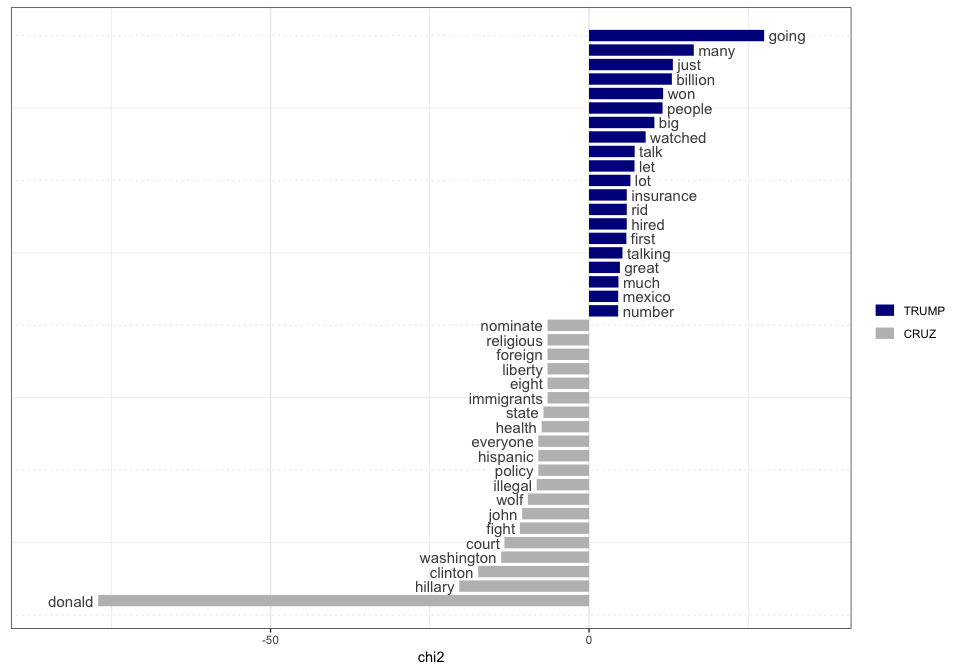

Introduction
------------

A frequent problem in processing texts is the need to segment one or few
documents into many documents, based on segments that they contain
marking units that the analyst will want to consider seperately.

This is a frequent feature of interview or debate **transcripts**, for
instance, where a single long source document might contain numerous
speech acts from individual speakers. For analysis, it’s likely that we
would want to consider these speakers separately, perhaps with the
ability to combine their speech acts later by spearker.

Here, we show how this can be done using the [**quanteda** R
package](https://quanteda.io), using a debate from the 2016 U.S.
presidential election campaign. This was the tenth debate among the
Republican candidates for the 2016 election, took place in Houston,
Texas on 25 February 2016, and was moderated by CNN. We demonstrate how
to download, import, clean, parse by speaker, and analyze the debate by
speaker.

Getting the text into R
-----------------------

The first step involves loading the debate into R. To read this text, we
can use the **rvest** package, which will automatically extract text
from the [US Presidency Project
website](http://www.presidency.ucsb.edu/ws/index.php?pid=111634).

    library("rvest")
    ## Loading required package: xml2
    scraping <- read_html("http://www.presidency.ucsb.edu/ws/index.php?pid=111634")
    txt <- scraping %>%
        html_nodes("p") %>%
        html_text()

We can see what the text looks like by examining the first and last
parts of the text.

    head(txt)
    ## [1] "About Search"                                                                                                                                                                                                                                                    
    ## [2] ""                                                                                                                                                                                                                                                                
    ## [3] "PARTICIPANTS:\nBen Carson;\nSenator Ted Cruz (TX);\nGovernor John Kasich (OH);\nSenator Marco Rubio (FL);\nDonald Trump;"                                                                                                                                        
    ## [4] "MODERATOR:\nWolf Blitzer (CNN); withPANELISTS:\nMaria Celeste Arrarás (Telemundo);\nDana Bash (CNN); and\nHugh Hewitt (Salem Radio Network)"                                                                                                                     
    ## [5] "BLITZER: We're live here at the University of Houston for the 10th Republican presidential debate. [applause]"                                                                                                                                                   
    ## [6] "An enthusiastic crowd is on hand here in the beautiful opera house at the Moore School of Music. Texas is the biggest prize next Tuesday, Super Tuesday, when 11 states vote, a day that will go a long way towards deciding who wins the Republican nomination."
    tail(txt, 10)
    ##  [1] "Nobody knows politicians better than I do. They're all talk, they're no action, nothing gets done. I've watched it for years. Take a look at what's happening to our country."                                                                                                                                                                                                                                           
    ##  [2] "All of the things that I've been talking about, whether it's trade, whether it's building up our depleted military, whether it's taking care of our vets, whether it's getting rid of Common Core, which is a disaster, or knocking out Obamacare and coming up with something so much better, I will get it done. Politicians will never, ever get it done. And we will make America great again. Thank you. [applause]"
    ##  [3] "BLITZER: Mr. Trump, thank you."                                                                                                                                                                                                                                                                                                                                                                                          
    ##  [4] "And thanks to each of the candidates, on behalf of everyone here at CNN and Telemundo. We also want to thank the Republican National Committee and the University of Houston. My thanks also to Hugh Hewitt, Maria Celeste, and Dana Bash."                                                                                                                                                                              
    ##  [5] "Super Tuesday is only five days away."                                                                                                                                                                                                                                                                                                                                                                                   
    ##  [6] "Presidential Candidate Debates, Republican Candidates Debate in Houston, Texas Online by Gerhard Peters and John T. Woolley, The American Presidency Project https://www.presidency.ucsb.edu/node/312591"                                                                                                                                                                                                                
    ##  [7] "The American Presidency ProjectJohn Woolley and Gerhard PetersContact"                                                                                                                                                                                                                                                                                                                                                   
    ##  [8] "Twitter Facebook"                                                                                                                                                                                                                                                                                                                                                                                                        
    ##  [9] "Copyright © The American Presidency ProjectTerms of Service | Privacy | Accessibility"                                                                                                                                                                                                                                                                                                                                   
    ## [10] ""

Cleaning the text
-----------------

To get only the text spoken by each candidate, we still need to remove
the non-text markers for events such as applause. We can do this using a
substitution of the text we wish to remove for the null string "", using
the powerful **stringi** package’s `stri_replace_all_regex()` function.
(As an alternative, we could have used `gsub()` or
`stringr::str_replace()` but we prefer **stringi**.)

    library("stringi", verbose = FALSE)
    # removes interjections
    txt <- stri_replace_all_regex(txt, 
                                  "\\s*\\[(APPLAUSE|BELL RINGS|BELL RINGING|THE STAR-SPANGLED BANNER|COMMERCIAL BREAK|CROSSTALK|inaudible|LAUGHTER|CHEERING)\\]\\s*", "",
                                  case_insensitive = TRUE)

Now we can see that the in-text notes such as “`[applause]`” are
removed.

    tail(txt, 11)[1:3]
    ## [1] "TRUMP: Thank you."                                                                                                                                                                                                                                                                                                                                                                                            
    ## [2] "Nobody knows politicians better than I do. They're all talk, they're no action, nothing gets done. I've watched it for years. Take a look at what's happening to our country."                                                                                                                                                                                                                                
    ## [3] "All of the things that I've been talking about, whether it's trade, whether it's building up our depleted military, whether it's taking care of our vets, whether it's getting rid of Common Core, which is a disaster, or knocking out Obamacare and coming up with something so much better, I will get it done. Politicians will never, ever get it done. And we will make America great again. Thank you."

Creating and segmenting the corpus
----------------------------------

Let’s now put this into a single document, to create as a **quanteda**
corpus object for processing and analysis.

    library("quanteda", warn.conflicts = FALSE, quietly = TRUE)
    ## Package version: 1.4.0
    ## Parallel computing: 2 of 12 threads used.
    ## See https://quanteda.io for tutorials and examples.

Because we want this as a single document, we will combine all of the
lines read as separate elements of our character vector `txt` into a
single element. This creates a single “document” from the debate
transcript. (Had we not scraped the document, for instance, it’s quite
possible that we would have input it as a single document.)

    corp <- corpus(paste(txt, collapse = "\n"), 
                   docnames = "presdebate-2016-02-25",
                   metacorpus = list(
                       source = "http://www.presidency.ucsb.edu/ws/index.php?pid=111634",
                       notes = "10th Republican candidate debate, Houston TX 2016-02-25")
                   )

We can now use the `summary()` method for a corpus object to see a bit
of information about the corpus we have just created.

    summary(corp)
    ## Corpus consisting of 1 document:
    ## 
    ##                   Text Types Tokens Sentences
    ##  presdebate-2016-02-25  3051  29978      2002
    ## 
    ## Source: http://www.presidency.ucsb.edu/ws/index.php?pid=111634
    ## Created: Wed Feb 13 11:00:18 2019
    ## Notes: 10th Republican candidate debate, Houston TX 2016-02-25

Our goal in order to analyze this by speaker, is to redefine the corpus
as a set of documents defined as a single speech acts, with a document
variable identifying the speaker. We accomplish this through the
`corpus_segment()` method, using the fact that each speaker is
identified by a regular pattern such as “TRUMP:” or “BLITZER:”. These
always start on a new line, and the colon (“:”) is always followed by a
space. We can turn this into a [regular
expression](https://www.regular-expressions.info/), and feed it as the
`pattern` argument to the function `corpus_segment()`.

    corpseg <- corpus_segment(corp, pattern = "\\s*[[:upper:]]+:\\s+", 
                              valuetype = "regex", case_insensitive = FALSE)

We needed to add `case_insensitive = FALSE` because otherwise, the upper
case character class will be overwritten, and we will pick up matches
for things like the “now:” in “I’m quoting you now: Let me be…”.

This converts our single document into a corpus of 538 documents,
extracting the regular expression. match in the text to `pattern`

    summary(corpseg, 10)
    ## Corpus consisting of 533 documents, showing 10 documents:
    ## 
    ##                      Text Types Tokens Sentences             pattern
    ##   presdebate-2016-02-25.1    18     27         1 \n\nPARTICIPANTS:\n
    ##   presdebate-2016-02-25.2     7      7         1      \nMODERATOR:\n
    ##   presdebate-2016-02-25.3    16     21         1        PANELISTS:\n
    ##   presdebate-2016-02-25.4   165    287        20         \nBLITZER: 
    ##   presdebate-2016-02-25.5    21     24         1         \nBLITZER: 
    ##   presdebate-2016-02-25.6    24     28         3         \nBLITZER: 
    ##   presdebate-2016-02-25.7   114    198        13       \n\nBLITZER: 
    ##   presdebate-2016-02-25.8    68     92         5          \nCARSON: 
    ##   presdebate-2016-02-25.9     3      3         1         \nBLITZER: 
    ##  presdebate-2016-02-25.10    98    164        10          \nKASICH: 
    ## 
    ## Source: http://www.presidency.ucsb.edu/ws/index.php?pid=111634
    ## Created: Wed Feb 13 11:00:19 2019
    ## Notes: corpus_segment.corpus(corp, pattern = "\\s*[[:upper:]]+:\\s+", valuetype = "regex", case_insensitive = FALSE)

Let’s rename `pattern` to something more descriptive, such as `speaker`.
To do this robustly, we will lookup the position of the names of the
docvars and replace it.

    names(docvars(corpseg))[which(names(docvars(corpseg)) == "pattern")] <- "speaker"

We can clean up the patterns further through some replacements.

    docvars(corpseg, "speaker") <- stri_trim_both(docvars(corpseg, "speaker"))
    docvars(corpseg, "speaker") <- stri_replace_all_fixed(docvars(corpseg, "speaker"), ":", "")
    # a misspelling in the transcript
    docvars(corpseg, "speaker") <- stri_replace_all_fixed(docvars(corpseg, "speaker"), "ARRARAS", "ARRASAS")

Now we can see that the tags are better:

    table(docvars(corpseg, "speaker"))
    ## 
    ##      ARRARÁS         BASH      BLITZER       CARSON         CRUZ 
    ##           25           28          103           14           67 
    ##       HEWITT       KASICH    MODERATOR    PANELISTS PARTICIPANTS 
    ##           24           25            1            1            1 
    ##        RUBIO        TRUMP 
    ##           92          152

We are only interested in the speakers who are presidential candidates,
so let’s remove the moderator Wolf Blitzer, the panelists Dana Bash,
Maria Celeste Arrarás, and Hugh Hewitt, and the generic tags
“Moderator”, “Participants”, and “Panelists”.

    corpcand <- corpus_subset(corpseg, !(speaker %in% c("ARRARÁS", "BASH", "BLITZER", "HEWITT",
                                                        "MODERATOR", "PANELISTS", "PARTICIPANTS")))

Now we have only statements from the five Republican candidates in our
corpus.

    corpcand
    ## Corpus consisting of 350 documents and 2 docvars.
    unique(docvars(corpcand, "speaker"))
    ## [1] "CARSON" "KASICH" "RUBIO"  "CRUZ"   "TRUMP"

Removing the final speaker (Blitzer) also removed some footer text that
was picked up as following this tag.

    tail(docvars(corpseg, "speaker"), 1)
    ## [1] "BLITZER"
    texts(corpseg)[ndoc(corpseg)] %>%
        cat()
    ## Mr. Trump, thank you.
    ## And thanks to each of the candidates, on behalf of everyone here at CNN and Telemundo. We also want to thank the Republican National Committee and the University of Houston. My thanks also to Hugh Hewitt, Maria Celeste, and Dana Bash.
    ## Super Tuesday is only five days away.
    ## Presidential Candidate Debates, Republican Candidates Debate in Houston, Texas Online by Gerhard Peters and John T. Woolley, The American Presidency Project https://www.presidency.ucsb.edu/node/312591
    ## The American Presidency ProjectJohn Woolley and Gerhard PetersContact
    ## Twitter Facebook
    ## Copyright © The American Presidency ProjectTerms of Service | Privacy | Accessibility

Because we removed Blitzer above when we created `corpcand`, we don’t
need to worry about removing the Footer text identifying the source of
the document as being the American Presidency Project.

    any(stringi::stri_detect_fixed(texts(corpcand), "American Presidency Project"))
    ## [1] FALSE

Analysis: Who spoke the most?
-----------------------------

We can answer this question in two ways: by the greatest number of
speech acts, created when a candidate spoke, and by the total number of
words that a candidate spoke in the debate.

To count and compare speech acts, we can tabulate the speech acts and
plot the speaker frequency as a barplot.

    par(mar = c(5, 6, .5, 1))
    table(docvars(corpcand, "speaker")) %>%
        sort() %>%
        barplot(horiz = TRUE, las = 1, xlab = "Total Times Speaking")

To compare candidates in terms of the total words spoke, we we can get
the individual words from `ntoken()`.

    par(mar = c(5, 6, .5, 1))
    texts(corpcand, groups = "speaker") %>%
        ntoken(remove_punct = TRUE) %>%
        sort() %>%
        barplot(horiz = TRUE, las = 1, xlab = "Total Words Spoken")

The `ntoken()` function does the work here of counting the tokens in the
vector of texts returned by the call to
`texts(corpcand, groups = "speaker")`, which extracts the texts from our
segmented corpus and concatenates all texts by speaker. This results in
a vector of the same 6 speakers as in our tabulation above. Passing
through the `remove_punct = TRUE` option in the `ntoken()` call sends
this argument through to `tokens()`, meaning we will not count
punctutation characters as tokens.

In both examples, we can see that Trump spoke the most and Carson the
least.

Analysis: What were they saying?
--------------------------------

If we wanted to go further, we convert the segmented corpus into a
*document-feature matrix* and apply one of many available psychological
dictionaries to analyze the tone of each candidate’s remarks.

Here we demonstrate this using the Regressive Imagery Dictionary, from
Martindale, C. (1975) *Romantic Progression: The Psychology of Literary
History.* Washington, D.C.: Hemisphere. The code below automatically
downloads a version of this dictionary in a format prepared for the
WordStat software by [Provalis](http://www.provalisresearch.com),
available from
<a href="http://www.provalisresearch.com/Download/RID.ZIP" class="uri">http://www.provalisresearch.com/Download/RID.ZIP</a>.
**quanteda** can import dictionaries formatted for WordStat, using the
`dictionary()` function. We will apply the RID dictionary to find out
who used what degree of “glory”-oriented language. (You might be able to
guess the results already.)

    # get the RID from the Provalis website
    download.file("http://provalisresearch.com/Download/RID.ZIP", "RID.zip")
    unzip("RID.zip")
    data_dictionary_RID <- dictionary(file = "RID.CAT", format = "wordstat")
    invisible(file.remove("RID.zip", "RID.CAT", "RID.exc"))

This is a nested dictionary object with three primary keys:

    names(data_dictionary_RID)
    ## [1] "PRIMARY"   "SECONDARY" "EMOTIONS"

There are additional keys nested inside each of these. We can show the
number of values for each nested entry for the “EMOTIONS” top-level key.

    lengths(data_dictionary_RID[["EMOTIONS"]])
    ## POSITIVE_AFFECT         ANXIETY         SADNESS       AFFECTION 
    ##              70              49              75              65 
    ##      AGGRESSION  EXPRESSIVE_BEH           GLORY 
    ##             222              52              76

We can inspect the category we will use (“Glory”) by looking at the last
sub-key of the third key, “Emotions”.

    tail(data_dictionary_RID[["EMOTIONS"]], 1)
    ## Dictionary object with 1 key entry.
    ## - [GLORY]:
    ##   - admir*, admirabl*, adventur*, applaud*, applaus*, arroganc*, arrogant*, audacity*, awe*, boast*, boastful*, brillianc*, brilliant*, caesar*, castl*, conque*, crown*, dazzl*, eagl*, elit*, emperor*, empir*, exalt*, exhibit*, exquisit*, extraordinary*, extrem*, fame, famed, famou*, foremost*, geniu*, glor*, gold*, golden*, grandeur*, great*, haughty*, hero*, homag*, illustriou*, kingdom*, magestic*, magnificent*, majestic*, majesty*, nobl*, outstand*, palac*, pomp*, prestig*, prid*, princ*, proud*, renown*, resplendent*, rich*, royal*, royalty*, sceptr*, scorn*, splendid*, splendor*, strut*, sublim*, superior*, superiority*, suprem*, thron*, triump*, victor*, victoriou*, victory*, wealth*, wonder*, wonderful*

Let’s create a document-feature matrix from the candidate corpus,
grouping the documents by speaker. This takes all of the speech acts and
combines them by the value of “speaker”, so that the new number of
documents is just five (one for each candidate).

    dfmatcand <- dfm(corpcand, groups = "speaker", verbose = TRUE)
    ## Creating a dfm from a corpus input...
    ##    ... lowercasing
    ##    ... found 350 documents, 2,507 features
    ##    ... grouping texts
    ##    ... created a 5 x 2,507 sparse dfm
    ##    ... complete. 
    ## Elapsed time: 0.082 seconds.

Because the texts are of different lengths, we want to normalize them
(by converting the feature counts into vectors of relative frequencies
within document):

    dfmatcand <- dfm_weight(dfmatcand, "prop")

Now we are in a position to apply the RID to the dfm, which matches on
the “glob” formatted wildcard expressions that form the values of the
RID in our `data_dictionary_RID` object.

    dfmatcandRID <- dfm_lookup(dfmatcand, dictionary = data_dictionary_RID)

Inspecting this, we see that all tokens have been matched to entries in
the Regressive Imagery Dictionary, so that the new features are now
“keys”, or dictionary categories, from the RID.

    head(dfmatcandRID, nf = 4)

<table>
<thead>
<tr class="header">
<th style="text-align: left;">document</th>
<th style="text-align: right;">PRIMARY.NEED.ORALITY</th>
<th style="text-align: right;">PRIMARY.NEED.ANALITY</th>
<th style="text-align: right;">PRIMARY.NEED.SEX</th>
<th style="text-align: right;">PRIMARY.SENSATION.TOUCH</th>
</tr>
</thead>
<tbody>
<tr class="odd">
<td style="text-align: left;">CARSON</td>
<td style="text-align: right;">0.0024295</td>
<td style="text-align: right;">0.0000000</td>
<td style="text-align: right;">0</td>
<td style="text-align: right;">0.0004859</td>
</tr>
<tr class="even">
<td style="text-align: left;">CRUZ</td>
<td style="text-align: right;">0.0012469</td>
<td style="text-align: right;">0.0000000</td>
<td style="text-align: right;">0</td>
<td style="text-align: right;">0.0004156</td>
</tr>
<tr class="odd">
<td style="text-align: left;">KASICH</td>
<td style="text-align: right;">0.0004850</td>
<td style="text-align: right;">0.0009699</td>
<td style="text-align: right;">0</td>
<td style="text-align: right;">0.0000000</td>
</tr>
<tr class="even">
<td style="text-align: left;">RUBIO</td>
<td style="text-align: right;">0.0019881</td>
<td style="text-align: right;">0.0000000</td>
<td style="text-align: right;">0</td>
<td style="text-align: right;">0.0000000</td>
</tr>
<tr class="odd">
<td style="text-align: left;">TRUMP</td>
<td style="text-align: right;">0.0007627</td>
<td style="text-align: right;">0.0006356</td>
<td style="text-align: right;">0</td>
<td style="text-align: right;">0.0003813</td>
</tr>
</tbody>
</table>

We can inspect the most common ones using the `topfeatures()` command,
which here we will multiply by 100 to get slightly easier to interpret
percentages.

    topfeatures(dfmatcandRID * 100, n = 10) %>%
        round(2) %>%
        knitr::kable(col.names = "Percent")

<table>
<thead>
<tr class="header">
<th></th>
<th style="text-align: right;">Percent</th>
</tr>
</thead>
<tbody>
<tr class="odd">
<td>SECONDARY.ABSTRACT_TOUGHT</td>
<td style="text-align: right;">14.51</td>
</tr>
<tr class="even">
<td>SECONDARY.SOCIAL_BEHAVIOR</td>
<td style="text-align: right;">11.79</td>
</tr>
<tr class="odd">
<td>SECONDARY.TEMPORAL_REPERE</td>
<td style="text-align: right;">11.20</td>
</tr>
<tr class="even">
<td>SECONDARY.INSTRU_BEHAVIOR</td>
<td style="text-align: right;">10.33</td>
</tr>
<tr class="odd">
<td>PRIMARY.REGR_KNOL.CONCRETENESS</td>
<td style="text-align: right;">9.59</td>
</tr>
<tr class="even">
<td>SECONDARY.MORAL_IMPERATIVE</td>
<td style="text-align: right;">3.72</td>
</tr>
<tr class="odd">
<td>EMOTIONS.AGGRESSION</td>
<td style="text-align: right;">3.40</td>
</tr>
<tr class="even">
<td>PRIMARY.SENSATION.VISION</td>
<td style="text-align: right;">2.54</td>
</tr>
<tr class="odd">
<td>EMOTIONS.AFFECTION</td>
<td style="text-align: right;">2.05</td>
</tr>
<tr class="even">
<td>SECONDARY.RESTRAINT</td>
<td style="text-align: right;">2.02</td>
</tr>
</tbody>
</table>

We could probably spend a whole day analyzing this information, but
here, let’s simply compare candidates on their relative use of language
in the “Emotions: Glory” category of the RID. We do this by slicing out
the feature with this label.

    dfmatcandRID[, "EMOTIONS.GLORY"]
    ## Document-feature matrix of: 5 documents, 1 feature (0.0% sparse).
    ## 5 x 1 sparse Matrix of class "dfm"
    ##         features
    ## docs     EMOTIONS.GLORY
    ##   CARSON   0.0009718173
    ##   CRUZ     0.0027015794
    ##   KASICH   0.0016973812
    ##   RUBIO    0.0019880716
    ##   TRUMP    0.0045760773

To make this a vector, we force it using `as.vector()`, as there is no
`drop = TRUE` option for dfm indexing. We then reattach the document
labels (the candidate names) to this vector as names. We can plot it
using a dotplot, showing that Trump was by far the highest user of this
type of language.

    glory <- as.vector(dfmatcandRID[, "EMOTIONS.GLORY"])
    names(glory) <- docnames(dfmatcandRID)
    dotchart(sort(glory), 
             xlab = "RID \"Glory\" terms used as a proportion of all terms",
             pch = 19, xlim = c(0, .005))

Comparing one candidate to another
----------------------------------

Thus far, we have employed some fairly simple plotting functions from
the **graphics** package. We can also draw on some of **quanteda**’s
“textplot” functions designed to work directly with its special object
classes.

For instance, we can easily determine which words were used mnost
differentially by Trump versus Cruz using some “keyness” statistics and
plots. Here we recreate the dfm, remove punctuation and English
stopwords, group by speaker, subset by just Trump and Cruz, compute
keyness statistics, and then plot the keyness statistics. We can do all
of this in one set of piped operations.

    dfm(corpcand, remove_punct = TRUE) %>%
        dfm_remove(stopwords("english")) %>%
        dfm_group(groups = "speaker") %>%
        dfm_subset(speaker %in% c("TRUMP", "CRUZ")) %>%
        textstat_keyness(target = "TRUMP") %>%
        textplot_keyness()

